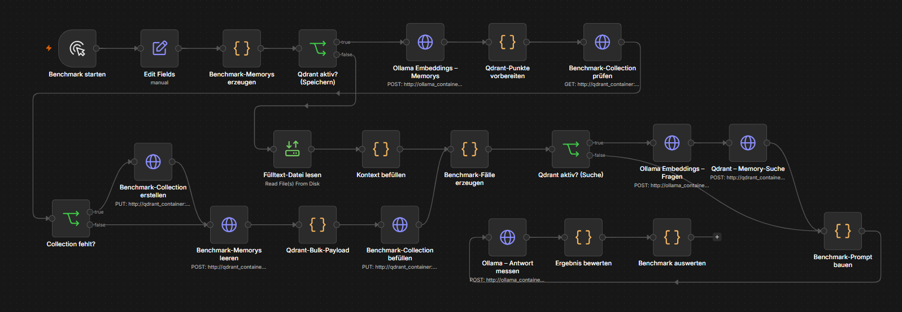

# Ollama iGPU Performance Tuning

Begleitmaterial zur Präsentation [`Ollama_iGPU_Performance_Tuning.pptx`](Ollama_iGPU_Performance_Tuning.pptx).
Dieses Repository zeigt, wie sich ein lokaler Ollama-Dienst mit iGPU-Unterstützung,
Qdrant als Vektordatenbank und n8n für reproduzierbare LLM-Benchmarks kombinieren lässt.

## Inhalt

- [`docker-compose.yml`](docker-compose.yml): Container für Ollama, Qdrant, n8n und einen optionalen Orientation-Dienst
- [`Modelfile`](Modelfile): Beispielkonfiguration für `qwen2.5:14b` mit festen Generierungs- und Hardwareparametern
- [`n8n_Ollama_Qdrant Benchmark.json`](n8n_Ollama_Qdrant%20Benchmark.json): n8n-Workflow für den Benchmark
- [`ollama-kv-info.sh`](ollama-kv-info.sh): interaktives Skript zur Anzeige von Modell- und KV-Cache-Informationen
- [`example-deutsch.txt`](example-deutsch.txt) und [`example-englisch.txt`](example-englisch.txt): Beispieltexte für lokale Tests
- [`Testlogik.png`](Testlogik.png): Übersicht des n8n-Testablaufs

## Testlogik

Der Workflow führt einen Benchmark in diesen Schritten aus:

1. Benchmark-Parameter und Testfälle werden erzeugt.
2. Die Benchmark-Memorys werden mit Ollama eingebettet.
3. Qdrant wird geprüft, bei Bedarf wird die Collection `nexamind_benchmark` erstellt und befüllt.
4. Die Testfragen werden ebenfalls eingebettet und optional gegen Qdrant gesucht.
5. Ollama erzeugt eine Antwort mit oder ohne den gefundenen Kontext.
6. Antwort, Laufzeit und Testergebnis werden gesammelt und ausgewertet.



Mit `use_qdrant` lässt sich derselbe Testlauf mit aktiviertem Retrieval und als Vergleich
ohne Retrieval ausführen. Dadurch können Kontextabruf, Antwortqualität und Laufzeit
getrennt betrachtet werden.

## Voraussetzungen

- Linux mit Docker Engine und Docker Compose Plugin
- Eine unterstützte AMD-iGPU sowie Zugriff auf `/dev/dri` und `/dev/kfd`
- Ausreichende Berechtigungen für die GPU-Gruppen, die in `docker-compose.yml` unter `group_add` eingetragen sind
- n8n erreichbar unter `http://localhost:5678`
- Ollama erreichbar unter `http://localhost:11434`
- Qdrant erreichbar unter `http://localhost:6333`

Die GPU-Geräte und Gruppen-IDs sind systemabhängig. Falls Ollama im Container die iGPU
nicht verwenden kann, müssen die Werte in `docker-compose.yml` an das Hostsystem angepasst
werden.

## Start

1. Beispiel-Fülltext für den n8n-Container bereitstellen:

	```bash
	mkdir -p n8n_files
	cp example-deutsch.txt n8n_files/filler_german.txt
	```

2. Die für den Benchmark benötigten Dienste starten:

	```bash
	docker compose up -d ollama qdrant n8n
	```

	Der `orientation`-Dienst ist optional. Sein Compose-Eintrag verwendet `build: .`,
	im Repository ist dafür derzeit kein Dockerfile enthalten.

3. Prüfen, ob die Container laufen:

	```bash
	docker compose ps
	curl http://localhost:11434/api/tags
	curl http://localhost:6333/collections
	```

## Ollama-Modell vorbereiten

Das [`Modelfile`](Modelfile) verwendet `qwen2.5:14b` als Basismodell. Das Modell muss
zunächst im Ollama-Container vorhanden sein:

```bash
docker exec -it ollama_container ollama pull qwen2.5:14b
docker cp Modelfile ollama_container:/tmp/Modelfile
docker exec -it ollama_container ollama create igpu-tuned-qwen -f /tmp/Modelfile
docker exec -it ollama_container ollama list
```

Im n8n-Workflow wird das Modell im Node **Edit Fields** über `model_name` ausgewählt.
Der mitgelieferte Workflow verwendet dort standardmäßig `llama3.2:latest`; für einen
Test mit dem Modelfile muss `model_name` auf `igpu-tuned-qwen` gesetzt werden. Alternativ
kann ein bereits installiertes Ollama-Modell verwendet werden.

## n8n-Workflow importieren

1. n8n unter `http://localhost:5678` öffnen.
2. Den Workflow aus [`n8n_Ollama_Qdrant Benchmark.json`](n8n_Ollama_Qdrant%20Benchmark.json) importieren.
3. Im Node **Edit Fields** die Testparameter prüfen:

	- `model_name`: Ollama-Modell
	- `context_size`: Kontextgröße in Tokens
	- `fill_percentage`: Anteil des mit Fülltext belegten Kontextfensters
	- `temperature`, `top_k`: Generierungsparameter
	- `use_qdrant`: Retrieval aktivieren oder deaktivieren
	- `qdrant_search_limit`: Anzahl der Qdrant-Treffer
	- `filler_file`: Pfad zur Fülltextdatei im n8n-Container

4. Den Workflow über **Benchmark starten** ausführen.

Die HTTP-Requests im Workflow verwenden die Compose-internen Hostnamen
`ollama_container` und `qdrant_container`. Der Workflow sollte daher innerhalb des
n8n-Containers ausgeführt werden; diese Namen sind nicht für Requests vom Host gedacht.

## KV-Cache- und Modellinformationen

Das Skript [`ollama-kv-info.sh`](ollama-kv-info.sh) fragt installierte Modelle und
verfügbare Kontextgrößen ab. Es benötigt `docker`, `curl`, `jq` und `awk` auf dem Host:

```bash
chmod +x ollama-kv-info.sh
./ollama-kv-info.sh
```

Das Skript fragt interaktiv ein Modell und eine Kontextgröße ab und unterstützt damit
den Vergleich verschiedener Speicher- und Kontextkonfigurationen.

## Aufräumen

Container stoppen:

```bash
docker compose down
```

Die Modell- und Qdrant-Daten bleiben in den lokalen Verzeichnissen `ollama_data` und
`qdrant_data` erhalten. Für einen vollständigen Neustart müssen diese Verzeichnisse
bewusst separat entfernt werden.
